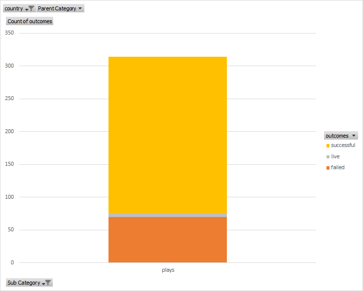

# An Analysis of Kickstarter Campaigns
Perform analysis on Kickstarter data to uncover trends (1st project)

## Data Summary

### Based on the analysis of the campaign data, these are some points to consider when launching a campaign: 

- The Theatre category is the most sought after for campaigning. Additionally, theatre is also the most successful of the campaigns.
- In Great Britain, the subcategory campaign of "Plays" has a high succcessful to faild ratio. 
- The best time to launch a campaign is during the month of May with the duration being around a month long. 
- Since funding is a major contribution to the success of a campaign, it is recommended that the goal be more around $4,000 to have a higher success rate. 

### The following graphs highlight some of the data summary points

#### This graph highlights the number of success and failed Plays in Great Britain

#### This graph shows a comparision of the different categories and their success criteria

#### This graph shows a trend of the outcomes based on the launch date of the campaign

Recommendations based on the data
- Start the campaign in May
- Reduce budget down to $4,000
