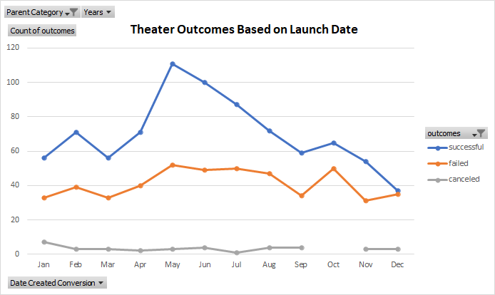
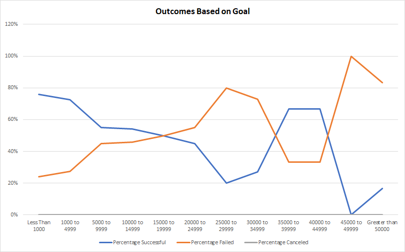

# Kickstarting with Excel

## Overview of Project

### Purpose
Louise is an up and coming play writer who wants to put her play "Fever" into action. She started a crowd funding campaign to support the cost of the project. Now that she's nearing her goal, she wants to know when is the best time to start. The purpose of this analysis is to understand how theater campaigns fared with respect to the launch date and funding goals. 

## Analysis and Challenges

### Analysis of Outcomes Based on Launch Date
The following graph shows a comparison of the outcome when compared to the launch date (in month) of theater campaigns. Based on the data, at no point in the year does the number of failed outcomes exceed the number of successful outcomes. December has the lowest number of success at 37 while May has the highest number with 111. The highest rate of failed outcome is also in December with 35. Although minor, there are some canceled outcomes as well. The month of January has 7 canceled outcomes while October has 0.

### Analysis of Outcomes Based on Goals
The following graph shows the rate of success in relation to the range of funding goals. Looking at the data trend, there are two areas where the success rate is higher than the failure rate. First, when funding is below $20,000 there is a higher rate of being successful. The lower the funding amount from $20,000, the higher the success rate. Second, the funding goal area between $35,000 and $44,999 also have a higher success rate. Although the second area is worth noting, the total project sample size is small and should be taken with precation. In all other funding ranges, the rate of failure exceeds the rate of success.   

### Challenges and Difficulties Encountered
Using the "COUNTIFS" formula was a challenge because of the multiple criterias that was required. Luckily, I was able to filter and do a count on the main spreadsheet to ensure the numbers match what the formula output. In an attempt to lessen the work by dragging the "COUNTIFS" formula from one row to the next, I was met with the tedious work of correcting the column definition to ensure that each formula is correctly coded. 

## Results
The best month to launch the theater campaign is in May because of the high number of successful outcomes. December is the worst month to launch the campaign because the number of successful and failed outcomes are almost identical. This means the probability of success in December is around 50%. Keeping the goal funding less than $20,000 leads to a higher rate of success. 
Although the data provides a good starting point, there are some limitations to the dataset that should be explore more. First, a table showing the outcomes based on funding goals broken down into the months would help with understanding why some months are more successful than others based on funding goals. Additionally, there is not enough projects in the higher funding rage to confidently justify its rate of failure.    
